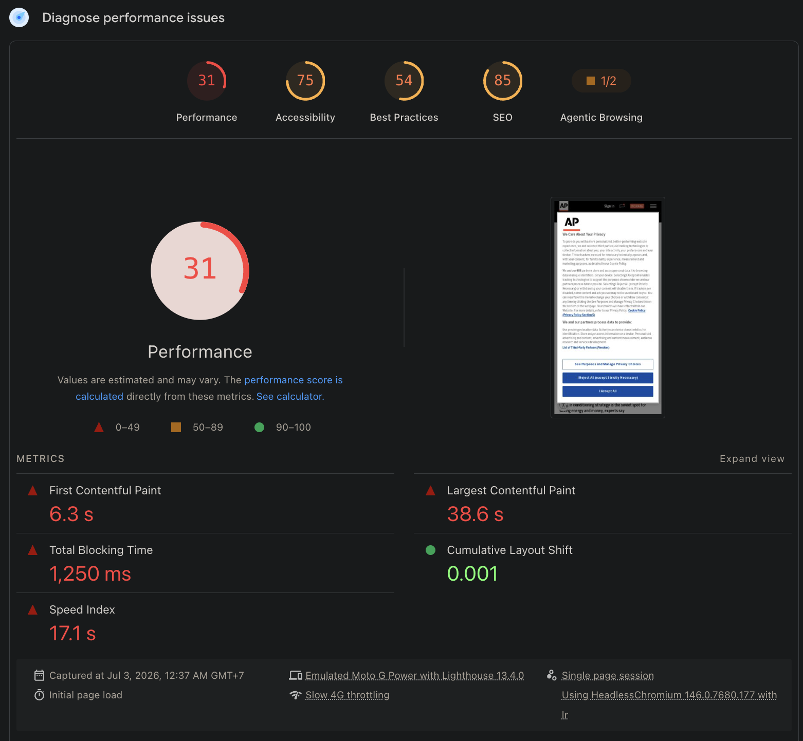
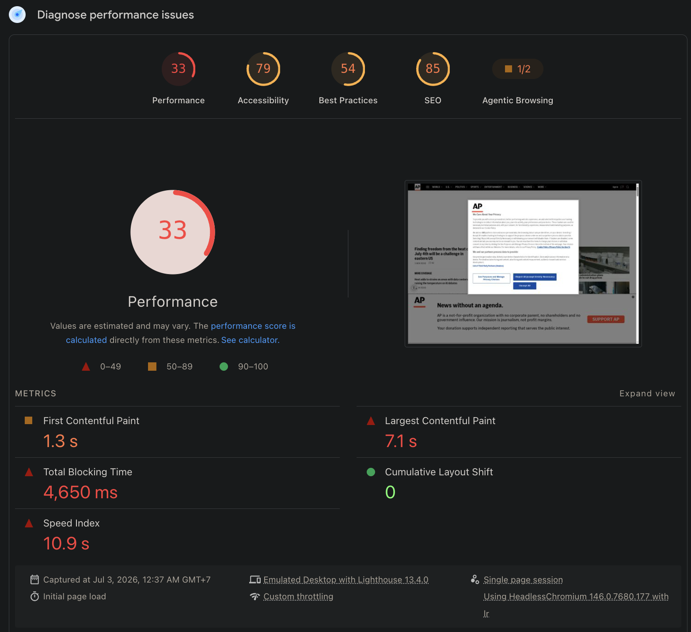

# AP News — Performance Audit (Course Project)

Course project for FE413 Web Performance. This is the class site we audit
together; this repo is my own version of it. This first commit is the kickoff:
the site, why it's a good candidate, the baseline PageSpeed scores, and the
pages I'll focus on.

## The site

AP News — https://apnews.com/ — the consumer news site of the Associated
Press, a non-profit global news agency.

## Why it's a good audit candidate

It's the site we're working through in class, and it's a fair target on its own
merits:

- It's a news site, so performance is a means, not the product — the kind of
  site that accumulates weight over time.
- It's heavy in the ways that hurt loading: a long feed of images, ad slots,
  and a large privacy/consent script that pulls in hundreds of third-party
  partners on the first visit (visible in the PSI screenshots below).
- It has a wide mix of content — articles, section fronts, topic hubs, photo
  galleries, video, search, and a donate/payment page — so different rendering
  paths can be compared on one site.
- Its audience is global and on every kind of device and connection, so the
  mobile numbers below matter for real people.

## Main PageSpeed Insights scores

Homepage (https://apnews.com/), captured 3 July 2026 with Lighthouse 13.4.0.
Mobile is an emulated Moto G Power on Slow 4G; desktop is the emulated desktop
profile.

| Category | Mobile | Desktop |
|----------|:------:|:-------:|
| Performance | 31 | 33 |
| Accessibility | 75 | 79 |
| Best Practices | 54 | 54 |
| SEO | 85 | 85 |

Key lab metrics — mobile: LCP 38.6 s, FCP 6.3 s, Total Blocking Time 1,250 ms,
Speed Index 17.1 s, CLS 0.001. Desktop: LCP 7.1 s, TBT 4,650 ms, Speed Index
10.9 s.

| Mobile | Desktop |
|:------:|:-------:|
|  |  |

Unlike a well-tuned site, AP News also fails the field data (CrUX, real users):
Core Web Vitals is Failed on both mobile and desktop. INP and CLS pass; the
failure is LCP — mobile field LCP 2.9 s, desktop 3.6 s, both in the
needs-improvement band, and far worse in the throttled lab (38.6 s mobile). So
LCP is the thread to pull on first. Field-data screenshots are in
`screenshots/01-kickoff/` (`apnews-mobile-field.png`, `apnews-desktop-field.png`).

## Pages the audit will focus on

| Page | URL | Why it's included |
|------|-----|-------------------|
| Homepage | https://apnews.com/ | Main entry point: a long headline feed with many images, ad slots, and the first-visit consent script. This is the page scored above. |
| Section front | https://apnews.com/politics | A topic landing with a long list of lazy-loaded article cards — how people browse a section, and a high-traffic page. |
| Topic hub | https://apnews.com/hub/artificial-intelligence | An aggregation page for an ongoing story; longer and more media-heavy than a plain section. |
| Article | https://apnews.com/article/ai-chatgpt-secretaries-administrative-assistants-jobs-c5988294ce6a2828e83ef7fe42706c48 | The core content type and most of the traffic. Long text, inline images, video/social embeds, related links, and ads. |
| Photo gallery | https://apnews.com/photo-gallery/major-global-news-moments-may-ap-photos-3462aeb752c1ead571dab7c39873e985 | The heaviest media page: many large images with lazy loading. AP is a major photo wire, so galleries are a real use case. |
| Search | https://apnews.com/search?q=artificial+intelligence | Client-driven results with pagination and in-page loading — a different rendering path from the article pages. |
| Donate | https://apnews.com/donate | A form/payment page with third-party embeds; the one transactional flow on the site. |

## Repo notes

Screenshots and traces are in `screenshots/`. As the course covers each topic
(rendering pipeline, metrics, network/caching) I'll add analysis and findings
here.
